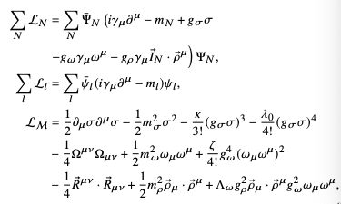
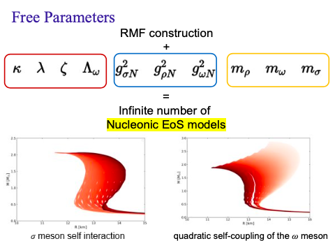

.. _readme:

***********************************
CompactObject Package Tutorials
***********************************

**An Open-Source Package for Neutron Stars**
**Comprehensive Workflow for Bayesian Inference Constraining**
**Neutron Star EOS Package**

**CompactObject** is an open-source package designed to perform Bayesian inference 
on neutron star equation of state (EOS) constraints. It offers a comprehensive workflow
that integrates astrophysical observations and nuclear measurements to explore the interior 
composition of neutron stars. The package is built to be user-friendly, easily extendable, 
and thoroughly documented, making it an essential tool for researchers in nuclear astrophysics.
The package integrates three independent modules:

1. **Tolman–Oppenheimer–Volkoff (TOV) Equation Solver**  
   A user-friendly solver for determining neutron star structure based on a given EOS.

2. **Neutron Star EOS Generator**  
   Generates EOS across the full density range. Currently, it includes the relativistic mean 
   field theory EOS solver and will support polytropes and additional EOS models in the future.

3. **Bayesian Inference Workflow**  
   A complete package for constraining the EOS of neutron stars. This includes defining the 
   likelihood from observations (X-ray timing, gravitational waves, radio timing) and nuclear 
   experiments (nuclear quantities, pQCD, chiral EFT), as well as from simulated astrophysical 
   observations. It also involves defining priors for the parameters and running nested sampling 
   of the posterior space.

These three components are independent, allowing users to integrate them into their workflows 
seamlessly. The package's functionality extends beyond inference studies, and we welcome 
contributions of new features.

For installation instructions, please refer to the `Installation Page <https://chunhuangphy.github.io/CompactObject/installation.html>`_.

**Publications**

Papers generated using this package include:

.. [1] **Huang, C., Raaijmakers, G., Watts, A. L., Tolos, L., & Providência, C.** (2024).  
   *Constraining fundamental nuclear physics parameters using neutron star mass-radius measurements I: Nucleonic models*.  
   *Monthly Notices of the Royal Astronomical Society*, 529.  
   `DOI:10.1093/mnras/stae844 <https://academic.oup.com/mnras/article/529/4/4650/7634362>`_

.. [2] **Huang, C., Tolos, L., Providência, C., & Watts, A.** (2024).  
   *Constraining a relativistic mean field model using neutron star mass-radius measurements II: Hyperonic models*.  
   *arXiv preprint arXiv:2410.14572*.  
   `https://arxiv.org/abs/2410.14572 <https://arxiv.org/abs/2410.14572>`_

.. [3] **Huang, C., & Zheng, X.-P.** (2024).  
   *Bayesian Insights into post-Glitch Dynamics: Model comparison and parameter constraint from decades-long observation data of the Crab pulsar*.  
   *arXiv preprint arXiv:2409.18432*.  
   `https://arxiv.org/abs/2409.18432 <https://arxiv.org/abs/2409.18432>`_

If you use our software, please consider citing us with the following standard citation:

The inference conducted here relies on the framework in the :math:`\textit{CompactObject}` package [CompactObject]_.  
This is an open-source, full-scope package designed to implement Bayesian constraints on the neutron star EOS. Other work based on this package is ....

.. _CompactObject: https://chunhuangphy.github.io/CompactObject/

Concept
=======

Bayesian inference studies of the neutron star equation of state have become a trending
field, particularly due to significant advancements such as the Neutron Star 
Interior Composition Explorer (NICER) measuring neutron star masses and radii through X-ray timing, and the detection of neutron star merger events through gravitational wave observations by the LIGO detector.

Below is the overall pipeline of this field:

.. image:: workflow.png
   :alt: Workflow Diagram

As depicted in this diagram, fundamental physics provides the EOS for neutron stars. By inputting the EOS into the Tolman–Oppenheimer–Volkoff (TOV) equation, we can obtain parameters related to the neutron star structure, such as mass, radius, and tidal properties. Instruments like NICER and LIGO measure these properties, providing data for Bayesian inference. This process constrains the EOS by determining the region in the Mass-Radius space where neutron stars can exist, ultimately offering insights into the fundamental composition of their interiors.

Equation of State
=================

The neutron star equation of state (EOS) plays a crucial role in determining the composition of a neutron star. It is closely connected to the microphysical properties of neutron stars. Here, we introduce an EOS derived from the Relativistic Mean Field (RMF) theory. The Lagrangian of this model is represented as follows:

.. math::

   \mathcal{L} = \sum_N \mathcal{L}_N + \mathcal{L}_{\mathcal{M}} + \sum_l \mathcal{L}_l

Where:

- :math:`\mathcal{L}_N` is the nucleonic Lagrangian
- :math:`\mathcal{L}_{\mathcal{M}}` is the meson part of the Lagrangian
- :math:`\mathcal{L}_l` is the lepton Lagrangian

Details of the Lagrangian are illustrated below:

In the equation:

- :math:`\Psi_{N}` and :math:`\psi_{l}` are the nucleon and lepton spinors
- :math:`\bar{I}_{N}` is the nucleon isospin operator
- :math:`g` denotes the strong interaction coupling of a meson to a nucleon
- :math:`m` represents the masses of the nucleons, mesons, and leptons
- The parameters :math:`\kappa`, :math:`\lambda_0`, :math:`\zeta`, and :math:`\Lambda_{\omega}` are coupling constants to be determined by the inference method

These free parameters represent the degrees of freedom in the RMF model and can be determined through nuclear experiments. Additionally, astrophysical observations can help constrain these parameters. The complete list of parameters includes:

These parameters should be inputted to generate the EOS using our EOS generators module. Different EOS parameters will affect mass-radius relations, as demonstrated here. For more details on the physics, refer to `Glendenning (1996) <https://ui.adsabs.harvard.edu/abs/1996cost.book.....G/abstract>`_.

Tolman–Oppenheimer–Volkoff (TOV) Equation
==========================================

The TOV equation is a general relativity equation that constrains the structure of a spherically symmetrical body under gravity. The original equation is:

.. math::

    \frac{d P}{d r} = -\frac{G m}{r^2} \rho \left(1 + \frac{P}{\rho c^2}\right) \left(1 + \frac{4 \pi r^3 P}{m c^2}\right) \left(1 - \frac{2 G m}{r c^2}\right)^{-1}

To solve this equation, the essential ingredient is the EOS. The basic strategy is as follows: at a given central density, input it into the neutron star EOS to obtain the pressure. Then, integrate the density from the center to the boundary, repeating this process across the entire possible density range.

In our code, we provide two different functions:

1. **Default Solver:**  
   Solves the TOV equation within a predefined density range (log(14.3, 15.6) on a scale of 10).

2. **Point-by-Point Solver:**  
   Allows solving the equation for any chosen central density range.

For more information on the TOV equation, visit the `Wikipedia page <https://en.wikipedia.org/wiki/Tolman–Oppenheimer–Volkoff_equation>`_.

Bayesian Inference
==================

Using Bayesian inference tools to explore constraints on the neutron star EOS is increasingly common. The foundational equation is Bayes' Theorem:

.. math::
    P(A \mid B) = \frac{P(B \mid A) P(A)}{P(B)}

Where:

- **Posterior Probability** (:math:`P(A \mid B)`): The probability of hypothesis A after observing B.
- **Prior Probability** (:math:`P(A)`): The initial probability of hypothesis A before observing B.
- **Likelihood** (:math:`P(B \mid A)`): The probability of observing B given that hypothesis A is true.
- **Evidence** (:math:`P(B)`): The probability of observing B under all possible hypotheses.

In this context:

- **Posterior** is the updated probability after considering new observations or experiments.
- **Prior** is the initial belief before new data is considered.
- **Likelihood** is the influence of new data on the belief.

The likelihood in our studies primarily comes from four sources:

1. **Mass-Radius Measurements from X-ray Timing** (e.g., NICER)
2. **Tidal Measurements from Gravitational Wave Detection**
3. **Mass Measurements from Radio Timing**
4. **Nuclear Physics Constraints from Experiments**

NICER's mass-radius measurements are a significant achievement in neutron star physics, comparable to gravitational wave detections. For the connection between our EOS and nuclear quantities, refer to `Chen & Piekarewicz (2014a) <https://journals.aps.org/prc/abstract/10.1103/PhysRevC.90.044305>`_.

The nuclear physics quantities we consider are:

- **K**: Compressibility of nuclear matter
- **J**: Symmetry energy at saturation density
- **L**: Slope of symmetry energy at saturation density

There are more on constraining the EOS by Pure neutron matter (PNM):

- **chiral EFT constraint**
- **pQCD constraint**

These can be computed from posterior samples (we will add the nuclear properties computation code in the near future). They also serve as independent constraints on the neutron star EOS.

When performing real astrophysical sampling, it is crucial to sample the neutron star central density corresponding to each measurement used. For instance, if investigating the constraining effect of two mass-radius measurements on the EOS, you need to define two additional free parameters—the central densities for each measurement. Otherwise, the inference would not represent a full-scope EOS analysis. Therefore, our likelihood functions include a parameter :math:`d_1`, representing the density parameter of each observation.

Summary
=======

**CompactObject** provides a comprehensive suite of tools for Bayesian inference on neutron star EOS constraints. By integrating astrophysical observations with nuclear experiments, it facilitates a deeper understanding of neutron star interiors.

For more information, tutorials, and support, please refer to our documentation or contact the development team.
